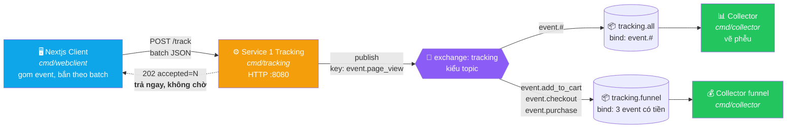
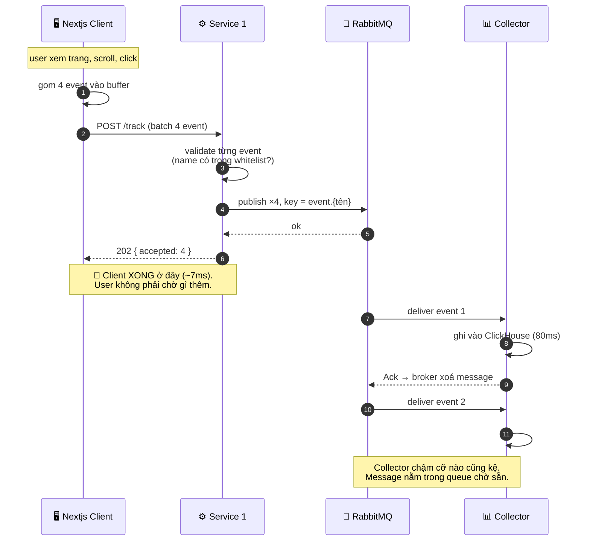
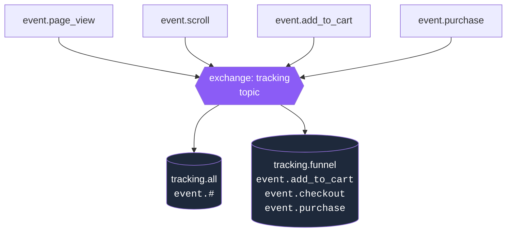
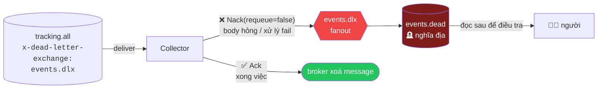
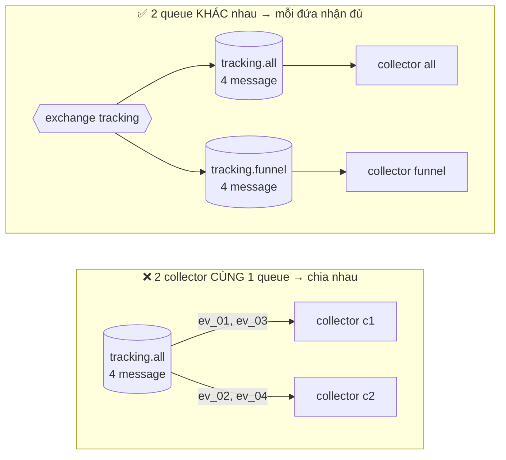
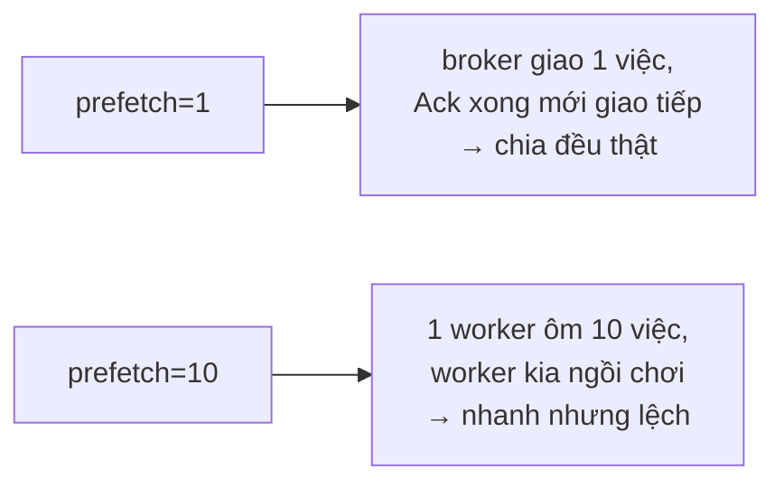
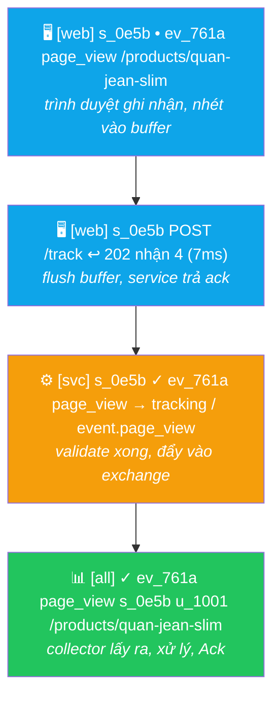
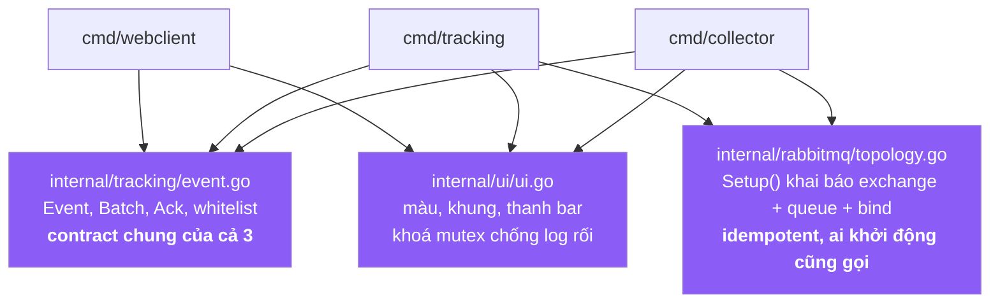

# Hệ thống tracking hoạt động thế nào

## 1. Toàn cảnh

Ba tiến trình rời nhau, nói chuyện qua HTTP và AMQP. Không đứa nào gọi thẳng đứa nào.



**Điểm mấu chốt:** mũi tên đứt nét (`202 accepted`) quay về client **trước khi** collector
xử lý xong. Đó là toàn bộ lý do RabbitMQ có mặt ở đây.

---

## 2. Một batch đi qua hệ thống ra sao



Nếu **không có** RabbitMQ, Service 1 phải tự ghi ClickHouse → client chờ 4×80ms = 320ms
thay vì 7ms. Và ClickHouse sập là mất luôn event.

---

## 3. Topic exchange lọc message thế nào

Service 1 chỉ publish **một lần** cho mỗi event, vào đúng một exchange.
Việc message nhân bản đi đâu là do **binding** quyết định, service không cần biết.



| Routing key         | `tracking.all`<br/>`event.#` | `tracking.funnel`<br/>3 key cụ thể |
|---------------------|:---------------------------:|:----------------------------------:|
| `event.page_view`   | ✅ | ❌ |
| `event.scroll`      | ✅ | ❌ |
| `event.click`       | ✅ | ❌ |
| `event.search`      | ✅ | ❌ |
| `event.add_to_cart` | ✅ | ✅ |
| `event.checkout`    | ✅ | ✅ |
| `event.purchase`    | ✅ | ✅ |

- `#` = khớp **nhiều từ** → `event.#` nuốt tất, kể cả event bạn thêm sau này.
- Một queue bind **nhiều key** = quan hệ **HOẶC**, không phải VÀ.
- Cùng một message vào 2 queue = **2 bản copy độc lập**. `tracking.funnel` Ack hay Nack
  không ảnh hưởng gì tới bản nằm ở `tracking.all`.

> Đây là con số thật đo được khi chạy 4 tab × 3 phiên:
> `tracking.all` nhận **63** event, `tracking.funnel` nhận đúng **8** (6 add_to_cart + 1 checkout + 1 purchase).

---

## 4. Message hỏng đi đâu — Dead Letter Queue



Ba đường ra của một message, không có đường thứ tư:

| Collector làm gì | Kết quả |
|---|---|
| `Ack()` | broker xoá message, xong đời |
| `Nack(requeue=false)` | bay sang `events.dlx` → nằm ở `events.dead` |
| **chết giữa chừng, chưa Ack** | broker giao lại cho worker khác (log hiện `⟳ GIAO LẠI`) |

Trường hợp 3 là lý do phải `Ack` **sau** khi làm xong việc, không phải trước.

---

## 5. Nhiều collector = chia việc, không phải nhân bản

Chỗ này rất hay nhầm.



- Muốn **chạy nhanh hơn** (chia tải): thêm collector vào cùng 1 queue.
- Muốn **xử lý khác nhau** (analytics vs email): tạo queue mới, bind riêng.

`prefetch` quyết định chia tải có đều không:



---

## 6. Lần theo 1 event qua cả 3 log

Mỗi event mang `ev_xxxx` + `s_xxxx` (session), in ra ở **cả ba** tiến trình.
Grep đúng 1 ID là thấy trọn đường đi:



```bash
# thấy trọn vòng đời của 1 event
go run ./cmd/webclient -users 2 2>&1 | grep ev_761a
```

---

## 7. Bản đồ code



`Setup()` **idempotent** — cả service lẫn collector đều gọi lúc khởi động, chạy bao
nhiêu lần cũng ra cùng kết quả. Nhờ vậy khởi động thứ tự nào cũng được.
